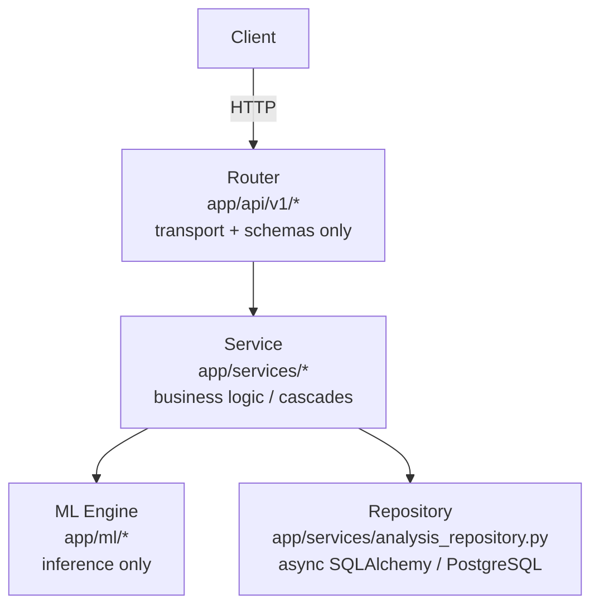

# Multi-Modal Emotion Recognition — Backend

Async FastAPI service that analyzes emotion across **Text**, **Audio**, and
**Video**, and combines them through a multi-tier **Fusion Mechanism**
(Early / Mid-Level / Late fusion). PostgreSQL (via `asyncpg`) is the only
persistence backend — Supabase has been fully removed from this project.

## Architecture (Separation of Concerns)



```text
backend/
  app/
    core/            # Settings (single source of env config) + logging setup
    db/               # SQLAlchemy async engine/session + ORM models
    schemas/          # Pydantic request/response models
    ml/               # Model wrappers: text_emotion, audio_emotion, facial_emotion, fusion
    services/         # Business logic + persistence orchestration
    api/v1/           # FastAPI routers (thin HTTP layer)
    main.py           # App factory, lifespan, middleware
  requirements.txt / pyproject.toml
  .env.example
```

## Setup

**1. Start PostgreSQL** (from the repository root, one level up)

```bash
cp .env.example .env      # repo root - used by docker-compose
docker-compose up -d
```

### 2. Configure the Backend

```bash
cd backend
cp .env.example .env      # adjust POSTGRES_* to match the root .env
```

**3. Install dependencies** (uv or pip)

```bash
uv sync            # or: pip install -r requirements.txt
```

### 4. Run the API

```bash
uvicorn app.main:app --reload
```

Docs: [http://localhost:8000/docs](http://localhost:8000/docs)

Health: [http://localhost:8000/health](http://localhost:8000/health)

Tables are created automatically on startup (`app.db.session.init_models`)
— no separate migration step is required for local development.

## API (all under `/api/v1`)

- `POST /text/analyze` - Analyze emotion in raw text
- `POST /audio/analyze` - Analyze audio (tone + transcript cascade into text)
- `POST /video/analyze` - Analyze video (facial + cascaded audio/text)
- `POST /fuse` - Fuse any subset of already-computed unimodal predictions
- `GET /history` - List persisted analyses

## Notes on the ML pipeline

- **Text**: loads the real local checkpoint at
  `app/ml/text_emotion/text_model/model.safetensors` (a BERT model
  fine-tuned on GoEmotions, 28 labels) via HuggingFace's safetensors-native
  `from_pretrained`. The `/text/analyze` endpoint returns the 27 non-neutral
  emotions, while the audio/video transcript cascade uses the same checkpoint
  in `coarse7` mode to produce the 7 coarse emotions used by fusion.
- **Audio**: Whisper for transcription + a Wav2Vec2 acoustic backbone.
  Whisper still comes from Hugging Face, but the acoustic emotion path is
  local-first: it loads the checked-in Keras checkpoint and scaler from
  `app/ml/audio_emotion/audio_model/` and falls back to the Hugging Face
  Wav2Vec2 backbone if the local model cannot be loaded.
- **Video**: samples frames and runs DeepFace's FER model when the
  optional `deepface` package is installed, with a deterministic
  fallback otherwise; the video's audio track is extracted via `ffmpeg`
  and run through the same audio cascade used by `/audio/analyze`.
- **Fusion**: `app/ml/fusion/engine.py` implements Early Fusion
  (concatenation), Mid-Level Fusion (a gated cross-modal projection that
  now uses softmax-normalized modality features), and Late Fusion
  (soft-voting ensemble). The final decision blends the mid-level and
  late tiers when `FUSION_METHOD=cross_attention`.

## Removed in this migration

- Supabase client, `SUPABASE_URL`/`SUPABASE_KEY`, and all associated auth
  (`/auth/signup`, `/auth/login`), admin, and profile endpoints.
- All database access now goes through async SQLAlchemy + `asyncpg`
  against a plain, self-hosted PostgreSQL instance.
